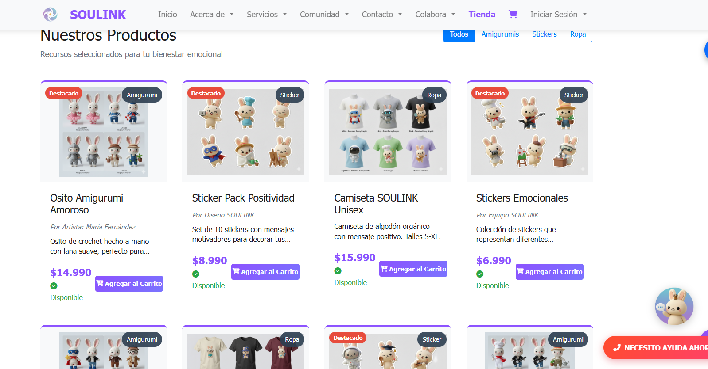
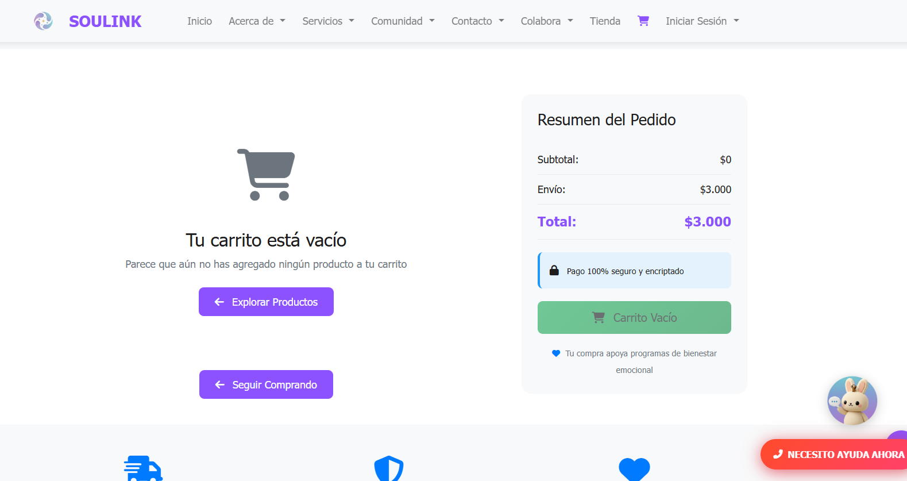
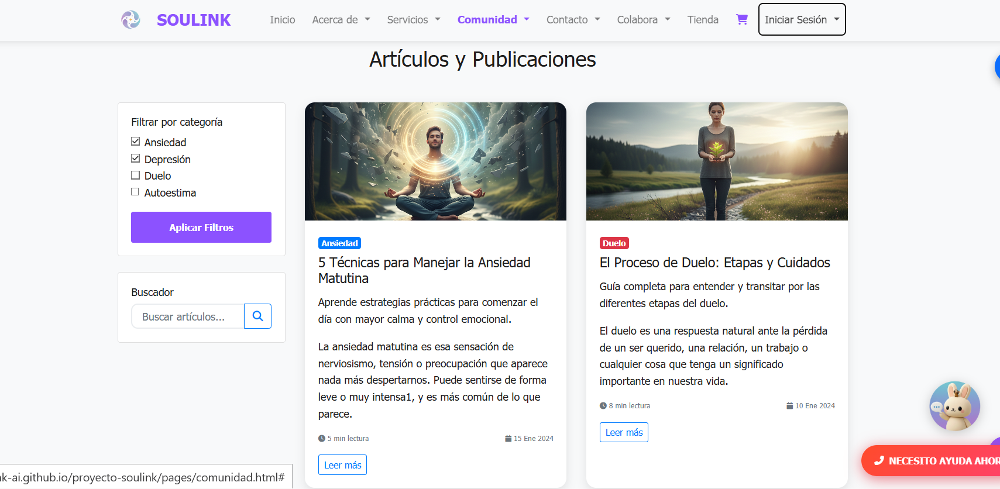
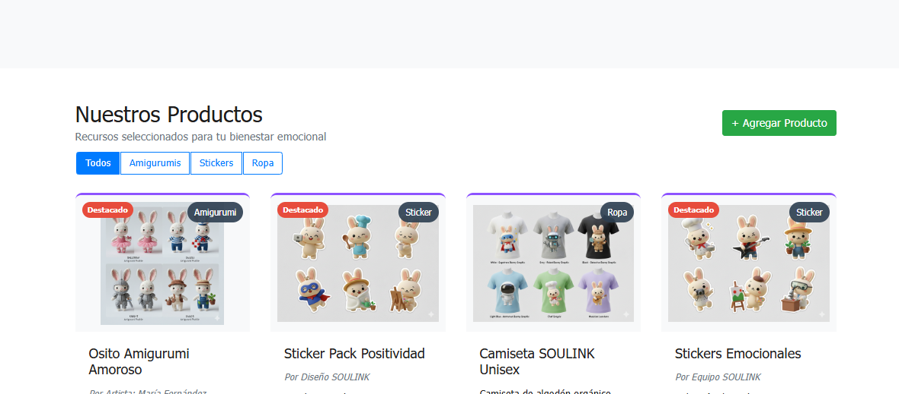
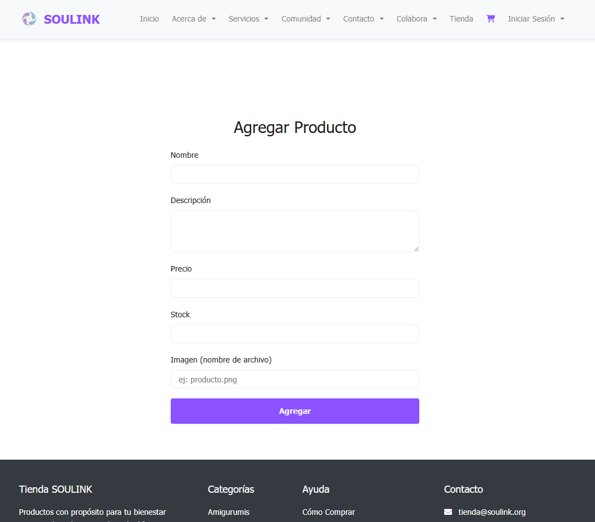
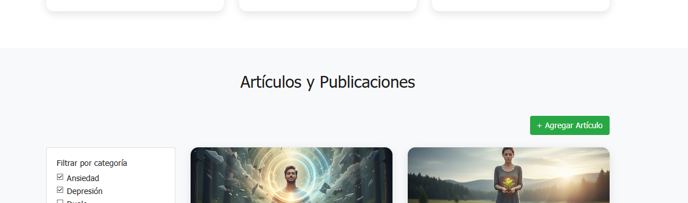
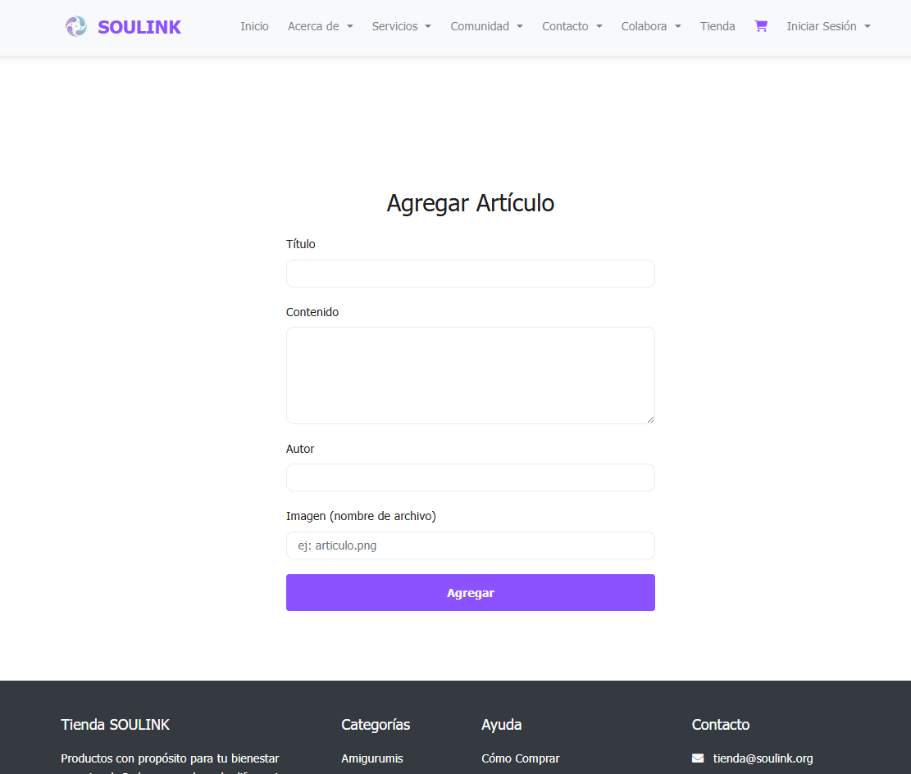

<h1 align="center" style="font-size: 2em; margin-bottom: 20px;">
  🌐 Soulink - Proyecto Web 🌐
</h1>

## 👥 Integrantes del equipo

<div align="center">

<table>
<tr>
<td>

## 👥 Equipo Q-ERO v3 Protocol

- Agustín Valenzuela
- Karim Valenzuela  
- Javier Valenzuela   
- Anita Morales  
- Nicolás Peña 
- Mauricio Narváez
- Vicente Díaz

</td>
<td align="center" valign="middle" width="320">
  
</td
</tr>
</table>

</div>

<div align="center">

[](https://ryuzenk-ai.github.io/proyecto-soulink/)

</div>

## 📋 ¿Qué es Soulink?
**SOULINK es una plataforma segura de apoyo emocional preventivo.** 
Encuentra contención, recursos y una comunidad que comprende por lo que pasas. Nuestra misión es ser el primer punto de contacto para personas que atraviesan momentos de vulnerabilidad, estrés, duelo o crisis emocionales, ofreciendo herramientas validadas antes de que las situaciones escalen a emergencias.

## 🎯 **Propósito Central**
Proveer **intervención temprana** y **herramientas de autocuidado** para prevenir crisis emocionales, reduciendo el estigma alrededor de la salud mental en Chile.

## 🚀 Características Principales

### 🛡️ **Apoyo Emocional Preventivo**
- ✅ **Chat de Contención 24/7** - Voluntarios capacitados disponibles  
- ✅ **Recursos Validados** - Técnicas de mindfulness, respiración y regulación emocional  
- ✅ **Comunidad Segura** - Grupos de apoyo moderados por especialistas  
- ✅ **Autoevaluación Emocional** - Herramientas para monitorear tu bienestar  

### 🛒 **Tienda de Bienestar**
- ✅ **Planes Freemium** - Acceso básico gratuito, premium con beneficios adicionales  
- ✅ **Productos Terapéuticos** - Kits de autocuidado, libros, materiales didácticos  
- ✅ **Merchandising con Propósito** - Productos que apoyan nuestra causa  
- ✅ **Suscripciones Mensuales** - Acceso a contenido exclusivo y sesiones grupales  

### 💻 **Experiencia Digital**
- ✅ **Diseño Responsive** - Accesible desde cualquier dispositivo  
- ✅ **Interfaz Intuitiva** - Navegación simple en momentos de vulnerabilidad  
- ✅ **Performance Optimizado** - Carga rápida cuando más se necesita  
- ✅ **Modo Oscuro** - Opción visual para mayor comodidad  


## 📋 Descripción de la Página Web
Repositorio principal para el desarrollo del sitio web de Soulink. Este proyecto contiene la implementación progresiva de la plataforma, incluyendo el frontend, componentes UI y la estructura completa del sitio.

## 🚀 Características de la Página Web
- ✅ Diseño moderno y responsive - Adaptable a todos los dispositivos
- ✅ Interfaz intuitiva - Navegación fácil y accesible
- ✅ Performance optimizado - Carga rápida y eficiente
- 🔄 Integraciones futuras - Preparado para conexión con backend
- 🔄 Componentes reutilizables - Arquitectura modular

## 🤝 ¿Quieres Colaborar?

### 💼 **Aliados Estratégicos**
Buscamos organizaciones que compartan nuestra visión para:
- Capacitaciones conjuntas
- Investigación en salud mental digital
- Campañas de prevención

### 💰 **Donaciones**
Tu contribución ayuda a:
- Mantener el servicio gratuito
- Capacitar más voluntarios
- Desarrollar nuevos recursos

## 📞 Contacto de Emergencia
**Si estás en crisis inmediata:**
- ☎️ Salud Responde: 600 360 7777
- ☎️ Hospital Digital: 800 360 077
- 📱 Texto: 3600

## 🚀 Próximas Funcionalidades
- [ ] App móvil nativa
- [ ] Inteligencia Artificial para detección temprana
- [ ] Red de profesionales asociados
- [ ] Programa para empresas
- [ ] Podcast semanal de bienestar emocional

## 🔗 Links de Interés 🔗
**📧 Contáctanos en:** [Soulink_quero@outlook.com](mailto:Soulink_quero@outlook.com)    
**🔗 Repositorio de GitHub:** [Repositorio GitHub](https://github.com/RyuZeNK-Ai/proyecto-soulink)  
**🔗 Pagina Web Temporal:** [Pagina WEB](https://ryuzenk-ai.github.io/proyecto-soulink)  

## 📁 Estructura del Proyecto
```
proyecto-soulink/          
├── assets/images               
│             ├── Conejo/        
│             ├── MerchConsejin/        
│             └── team/      
├── pages/                  
│     ├── acerca.html         
│     ├── servicios.html      
│     ├── contacto.html             
│     ├── admin.html             
│     ├── tienda.html
│     ├── carrito.html
│     ├── colaboraciones.html
│     ├── login.html   
│     └── comunidad.html   
├── js/
|    ├── darkmode.js   
│    └── soulink.js                
├── css/             
│     ├── admin.css        
│     ├── responsive.css
│     └── styles.css
├── data/     
│      └── productos.json
├── README.md
├── index.html                 
└── .gitignore     
    
```
## 📸 Screenshot 1 - Sección "Acerca de"


## 📸 Screenshot 2 - Sección "Contacto"


## 📸 Screenshot 3 - Sección "Tienda"



## 📸 Screenshot 4 - Sección "Carrito"



## 📸 Screenshot 5 - Sección "Artículos"



## 📸 Screenshot 6 - Formulario "Agregar Producto"





*Formulario para añadir nuevos productos a la tienda, con campos de título, descripción y precio.*

## 📸 Screenshot 7 - Formulario "Agregar Articulo"




*Formulario para añadir nuevos productos a la tienda, con campos de título, descripción y precio.*


